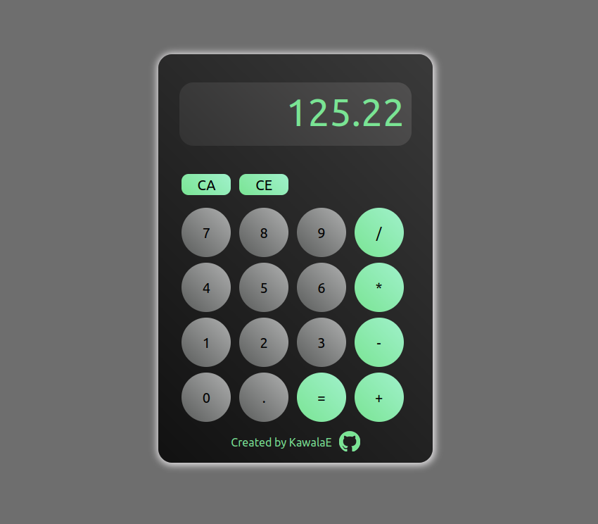

Online calculator created with Java Script, HTML and CSS.
 It is available at the following link: <strong> https://kawalae.github.io/Calculator/ </strong>
 

It supports floating-point numbers. All calculator options can be clicked as well as typed on your keyboard. It has a backspace function, available under the CE button, clear all function under CA button. 

 

Acknowledgements:
1. Page icon - <a href="https://www.flaticon.com/free-icons/calculator" title="calculator icons">Calculator icons created by Freepik - Flaticon</a>          